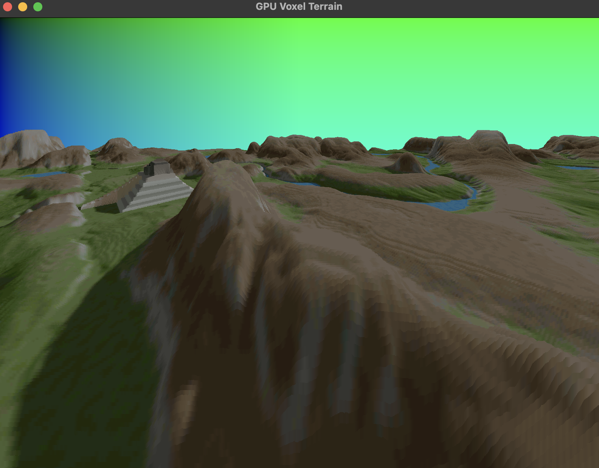

# Voxel Terrain




GPU implementation of the 'Voxel Space' algorithm (first pioneered by NovaLogic in the 1992 game *Comanche: Maximum Overkill*) in order to render voxel terrain using Rust and wgpu.

The algorithm takes in a height and a color map to efficiently generate a 2.5D from just a height and color map (overcoming the CPU limitations of the '90s to render graphics that were ahead of its time). For my GPU implementation, these were represented as textures, which were passed into the shader as a bind group, along with a uniform for camera values. Textures also include a sampler in order to handle the repeating/periodic nature of the color and height maps.

```wgsl
struct CameraUniform {
    p: vec2<f32>,
    height: f32,
    angle: f32,
    screen_width: u32,
    screen_height: u32,
};

@group(0) @binding(0)
var<uniform> camera: CameraUniform;
@group(1) @binding(0)
var t_height_map: texture_2d<f32>;
@group(1) @binding(1)
var s_height_map: sampler;
@group(2) @binding(0)
var t_color_map: texture_2d<f32>;
@group(2) @binding(1)
var s_color_map: sampler;
```

```Rust
let sampler = device.create_sampler(
    &wgpu::SamplerDescriptor {
        address_mode_u: wgpu::AddressMode::Repeat,
        address_mode_v: wgpu::AddressMode::Repeat,
        address_mode_w: wgpu::AddressMode::Repeat,
        ...
    }
);
```


The crux of the algorithm is also in the shader,
which is modified to work per pixel (instead of drawing lines) and also normalizes the texture values to UV coordinates in order to accurately sample it.

```wgsl
@fragment
fn fs_main(@builtin(position) pos: vec4f) -> @location(0) vec4<f32> {
    let horizon = f32(camera.screen_height / 2);
    let scale_factor = f32(camera.screen_height * 2);
    let sinPhi = sin(camera.angle);
    let cosPhi = cos(camera.angle);
    let distance = 1000.0;

    // Normalize coordinates to [0, 1.0]
    let uv = pos.xy / vec2f(f32(camera.screen_width - 1u), f32(camera.screen_height - 1u));
    var sky_color = vec4f(0.0, uv, 1.0);

    let map_size = textureDimensions(t_height_map, 0).xy;

    for (var z = 0.0; z < distance; z = z + 1.0) {
        // let half_width = z * tan(camera.fov * 0.5);  // Field of view scaling
        let half_width = z * tan(90 * 0.5);  // Field of view scaling

        let pleft = vec2(
            -cosPhi * half_width - sinPhi * z + camera.p.x,
            sinPhi * half_width - cosPhi * z + camera.p.y
        );
        let pright = vec2(
            cosPhi * half_width - sinPhi * z + camera.p.x,
            -sinPhi * half_width - cosPhi * z + camera.p.y
        );

        let dx = (pright - pleft) / f32(camera.screen_width);
        var current = pleft + (pos.x * 0.5 + 0.5) * dx;

        let map_uv = (current.xy / vec2<f32>(f32(map_size.x - 1u), f32(map_size.y - 1u)));
        let height_val = textureSample(t_height_map, s_height_map, map_uv).r * 255.0;
        let height_on_screen = ((camera.height - height_val) / z) * scale_factor + horizon;

        if (height_on_screen < pos.y) {
            return textureSample(t_color_map, s_height_map, map_uv);
        }
    }

    return sky_color;
}
```

# To-do
- Working camera controller (with delta time)
- Cool GIF Gallery
- More height/color maps
- Circular clipping
- Front-to-back rendering
- Incremental step-size

# Sources
'Learn Wgpu' by Ben Hansen https://sotrh.github.io/learn-wgpu/

'Terrain rendering algorithm in less than 20 lines of code' by Sebastian Macke https://github.com/s-macke/VoxelSpace