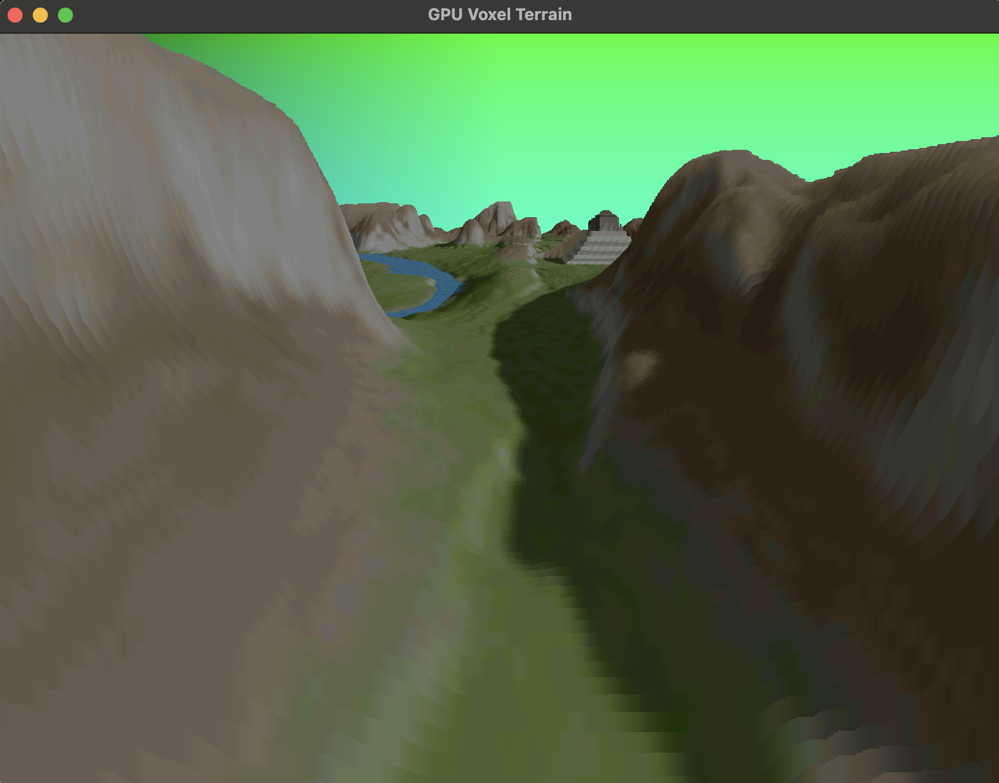

# GPU Voxel Terrain

An implementation of the "Voxel Space" terrain rendering algorithm (popularized by NovaLogic's 1992 game *Comanche: Maximum Overkill*) utilizing the modern WebGPU API via Rust's `wgpu` ecosystem. This project demonstrates how to efficiently port traditional CPU-based raycasting/rasterization algorithms to the GPU for massive performance gains, enabling high-resolution 2.5D terrain generation from simple height and color maps.



## Technical Architecture

This engine leverages **Rust** and **wgpu** to create a highly parallelized compute and rendering pipeline:
- **Compute Shader (`voxels.wgsl`):** Offloads the core Voxel Space raycasting logic to the GPU. For every pixel (or column), the shader calculates the intersection of view rays with the height map.
- **Render Shader (`shader.wgsl`):** A simple fullscreen quad vertex/fragment shader that samples the generated output texture from the compute pass and presents it to the swap chain.
- **Windowing & Events:** Handled via `winit`, supporting both desktop and web targets (via `wasm-bindgen`).

## The Rendering Pipeline

1. **Resource Loading:** 
   - A `height-map.png` (representing elevation) and `color-map.png` (representing terrain albedo) are loaded into wgpu `Texture` bindings with custom samplers configured to repeat at their edges.
   - A unified camera structure is updated per-frame and uploaded via a Uniform Buffer Object (UBO).
   
```Rust
let sampler = device.create_sampler(
    &wgpu::SamplerDescriptor {
        address_mode_u: wgpu::AddressMode::Repeat,
        address_mode_v: wgpu::AddressMode::Repeat,
        address_mode_w: wgpu::AddressMode::Repeat,
        ...
    }
);
```

```wgsl
struct CameraUniform {
    p: vec2<f32>,
    height: f32,
    angle: f32,
    fov: f32,
    screen_width: u32,
    screen_height: u32,
};

@group(0) @binding(0) var<uniform> camera: CameraUniform;
@group(1) @binding(0) var t_height_map: texture_2d<f32>;
@group(1) @binding(1) var s_height_map: sampler;
@group(2) @binding(0) var t_color_map: texture_2d<f32>;
@group(2) @binding(1) var s_color_map: sampler;
@group(3) @binding(0) var frame: texture_storage_2d<rgba8unorm, read_write>;
```

2. **Compute Pass:** 
   - A 2D workgroup is dispatched based on the screen's dimensions.
   - The shader normalizes screen coordinates, applying field-of-view (FOV) and perspective transformations given the current view angle.
   - Iterating from the camera's near plane to the distance threshold, it calculates the corresponding UV coordinates on the map.
   - The algorithm is modified to work per pixel instead of drawing lines: if the projected height of the terrain at the current distance is greater than the current pixel's Y coordinate, the corresponding color is sampled and written to a `StorageTexture(Rgba8Unorm)`.

```wgsl
@compute @workgroup_size(256)
fn render(@builtin(global_invocation_id) global_id: vec3<u32>) {
    let x = i32(global_id.x);
    let j = i32(global_id.y);

    // Only run algorithm on every column (vertical scan lines) to save compute
    if (j == 0) {
        // Camera constants (scaled based off screen dimensions)
        let horizon = f32(camera.screen_height) / 4.0;
        let scale_factor = f32(camera.screen_height) * 1.2;
        let sinPhi = sin(camera.angle);
        let cosPhi = cos(camera.angle);
        let distance = 1500.0;
        var step_size = 0.2f;

        // Run algorithm on map
        let map_size = textureDimensions(t_height_map, 0).xy;
        var maximum_height = i32(camera.screen_height);

        for (var z = 0.2f; z < distance; z += step_size) {
            // Incremental step size (less level of detail with further distance)
            step_size += 0.005f;

            // Field of view scaling and rotation calculations
            let half_width = z * tan(camera.fov * 0.5);
            let pleft = vec2(
                -cosPhi * half_width - sinPhi * z + camera.p.x,
                sinPhi * half_width - cosPhi * z + camera.p.y
            );
            let pright = vec2(
                cosPhi * half_width - sinPhi * z + camera.p.x,
                -sinPhi * half_width - cosPhi * z + camera.p.y
            );

            let dx = (pright - pleft) / f32(camera.screen_width);
            var current = pleft + f32(x) * dx;

            // Normalize texture sampling coordinates to [0, 1.0]
            let map_uv = (current.xy / vec2<f32>(f32(map_size.x - 1u), f32(map_size.y - 1u)));
            let height_val = textureSampleLevel(t_height_map, s_height_map, map_uv, 0.0).r * 255;

            // Adjust height on screen based on camera constants like height and distance from camera (z value)
            let height_on_screen = ((camera.height - height_val) / z) * scale_factor + horizon;

            // Sample terrain color from color map
            let terrain_color = textureSampleLevel(t_color_map, s_color_map, map_uv, 0.0);

            for (var y = i32(height_on_screen); y < maximum_height; y = y + 1) {
                // Sample repeating texture for color and compute fog based of z distance (blends into sky with distance)
                let norm_y = (f32(y) / f32(camera.screen_height - 1u));
                let sky_color = vec4f(vec3f(0.3, 0.5, 1.0) * (1.0 - norm_y), 1.0);
                let fog = pow((distance - z) / distance, 0.5);
                let shaded_terrain = ((fog * terrain_color) + (1 - fog) * sky_color);

                textureStore(frame, vec2<i32>(x, y), shaded_terrain);
            }

            // Adjust maximum height
            if (i32(height_on_screen) < maximum_height) {
                maximum_height = i32(height_on_screen);
            }
        }

        // Draw a sky
        for (var y = 0; y < maximum_height; y = y + 1) {
            let norm_y = (f32(j) / f32(camera.screen_height - 1u));
            let sky_color = vec4f(vec3f(0.3, 0.5, 1.0) * (1.0 - norm_y), 1.0);
            textureStore(frame, vec2<i32>(x, y), sky_color);
        }

        // DrawVerticalLineGradient(x, 0.0, maximum_height, vec3f(0.3f, 0.5f, 1.0f), camera.screen_height);
    }
}
```

3. **Render Pass:**
   - The `StorageTexture` populated by the compute pass is bound as a regular texture to the fragment shader.
   - A fullscreen quad is drawn to blit the raycasted terrain onto the screen perfectly fitting the viewport dimensions.

## Building and Running

This project targets both native (Windows, macOS, Linux) and WebAssembly (`wasm32-unknown-unknown`).

### Native
Ensure you have the latest stable Rust toolchain installed.
```bash
cargo run --release
```

### WebAssembly (WebGL2/WebGPU)
To run in the browser, you will need to compile via `wasm-pack` to target and serve it.
```bash
wasm-pack build --target web
```

# Sources
'Learn Wgpu' by Ben Hansen https://sotrh.github.io/learn-wgpu/

'Terrain rendering algorithm in less than 20 lines of code' by Sebastian Macke https://github.com/s-macke/VoxelSpace

'Method for rendering realistic terrain simulation' https://patents.justia.com/patent/6700573